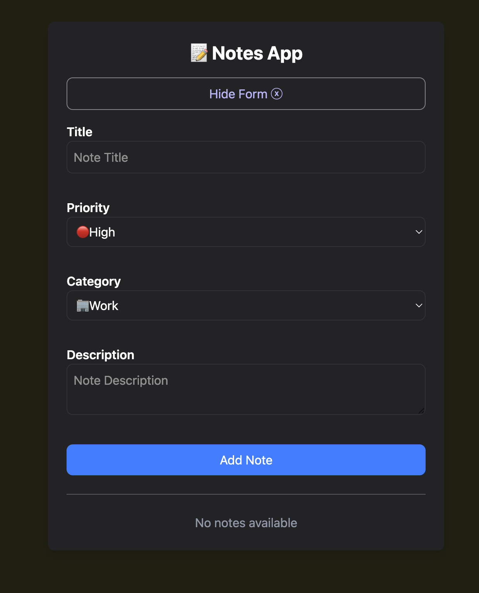
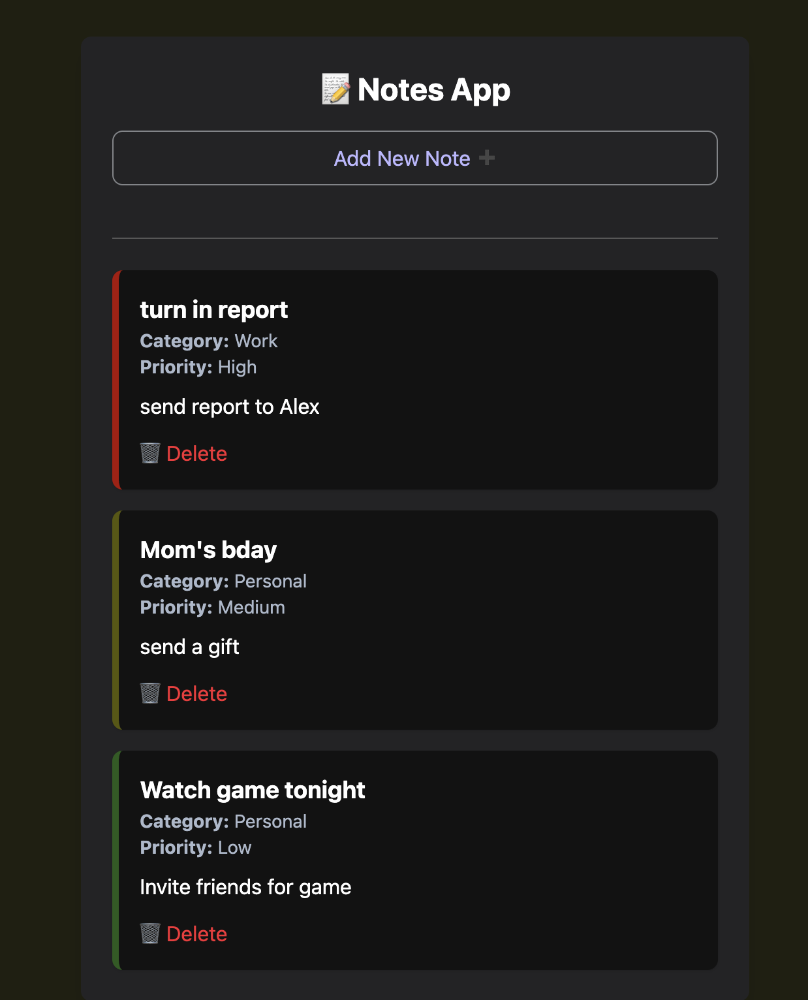

# React Notes App

A simple notes application built with React, Vite, and TailwindCSS.

## Getting Started

### 1. **Install dependencies:**

```bash
npm install
```

### 2. **Run the app:**

```bash
npm run dev
```

### 3. **Open your browser at:**  

[http://localhost:5173/](http://localhost:5173/)

## Screenshots of App
<div style="display: flex; justify-content: center; gap: 20px;">
  
  
</div>
